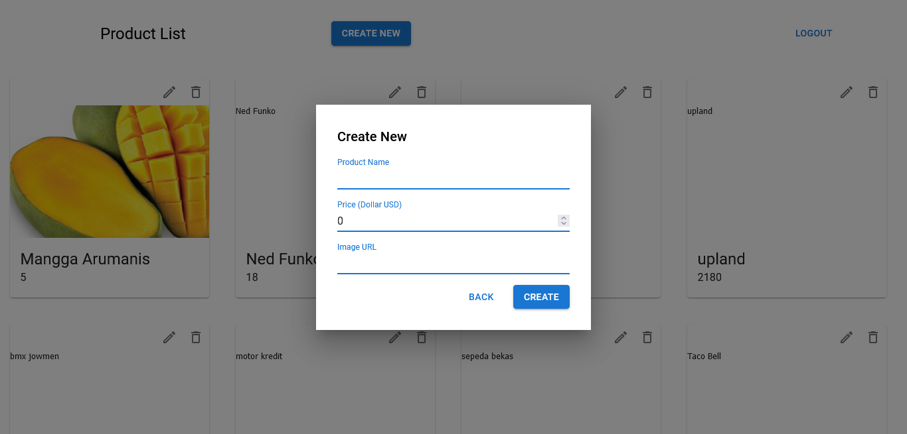

# Binar Mock Technical Test

## Application Configuratio
1. Clone this repository: `git clone https://github.com/alexgodjirah/binar-mock-test.git`
2. Install the used packages using command: `yarn`
3. Start the application using command: `yarn start`
4. The application will launch automatically to our browser

 
 

## Application Features
### LOGIN http://localhost:3000/
Login is the first page shown in the application. To continue to the other page, please login first using following email & password: 

 

Email: admin@admin.com

Password: admin

Or, we can register new account by clicking register hyperlink below. Or go to this link: http://localhost:3000/register

 
 

### REGISTER http://localhost:300/register
This page will be shown if we got to the path http://localhost:3000/register. We can use this page to create an account to login and access this application. We can use any name, email, or password. If we fill this form correctly, we will be directed to login page.

If we already have an account, we can login to login page. Or go to this link: http://localhost:3000/

 
 

### DASHBOARD/COLLECTION LIST http://localhost:3000/dashboard
This page will be shown if we login successfully. This page is where we can see the collection in our application. To create new item, click create new button in the navigation bar. To edit item, click edit icon (pencil icon) above each item. To delete item, click delete icon (trash bin icon) above each item.

 
 

### CREATE ITEM http://localhost:3000/dashboard
This pop-up component will be used to create new item. To create item, click the create new button in the navigation bar, then we must input the right data (Product name, Price, and Image URL), and click the create button. If the data is correct, the item will appear at the bottom of the page.

 
 

### EDIT ITEM http://localhost:3000/dashboard
This pop-up component will be used to update the existing item. To update/edit existing item, click the edit icon (pencil icon) above each item, then we must input the right data (Product name, price, Image URL), and click the update button. If the data is correct, the item will be updated.

 
 

### DELETE ITEM http://localhost:3000/dashboard
This pop-up ciomponent will be used to delete the existing item. TO delete existing item, clik the delete icon (trash bin icon) above each item, then click the `Yes, delete it` button. The item will be deleted from the page.

